# Eterea Blender Tools

A unified kit that bundles the Eterea tools (etereaestudios.com) for Blender into a single install, using Blender's **Extension** format (not the legacy add-on system).

Version **1.7.0** · Requires **Blender 5.2** or newer · License **GPL-3.0-or-later**

This is the full manual of the kit. For a short overview and the download links, see the [repository README](../README.md).

---

## Installation

1. In Blender: `Edit > Preferences > Get Extensions > ⌄ (top-right menu) > Install from Disk...`
2. Select the downloaded `etr_blender_tools-<version>.zip`.
3. Enable it if it is not enabled automatically.

**Updating**

Install the new `.zip` the same way (`Install from Disk...`); it replaces the version you already have. Restart Blender if it asks you to.

---

## Where to find the tools

Most tools hook into Blender's native menus and panels. Two places are shared by several tools:

### "Eterea Tools" right-click submenu

An **Eterea Tools** submenu is added at the end of these right-click (context) menus:

| Where you right-click                                      | What you find inside                                                                |
| ---------------------------------------------------------- | ----------------------------------------------------------------------------------- |
| 3D Viewport, Object Mode                                   | Batch Operate Attributes · Round Values · Toggle Lock Channels                      |
| Outliner                                                   | Batch Operate Attributes · Round Values · Toggle Lock Channels                      |
| 3D Viewport, Curve Edit Mode                               | Set Curve Radius to 1.0                                                             |
| Node Editors (Shader, Geometry Nodes, Compositor, Texture) | Change Color Space *(Shader Editor only)* · Remove Custom Label from Selected Nodes |

Inside the submenu all commands are listed directly (no nested submenus), and the commands of each tool are separated from the next tool by a horizontal line. The submenu is only shown when at least one of its commands is available (for example, *Batch Operate Attributes* only appears when a Mesh, Curves or Point Cloud object is selected, and *Change Color Space* only in the Shader Editor).

### "Eterea Tools" tab in the 3D Viewport Sidebar (N)

The kit has its own tab in the 3D Viewport Sidebar (`N`), called **Eterea Tools**. When the Sidebar tabs are collapsed (Blender 5.2) it is shown as **ET**. It contains these panels:

- **Subdivision**, with three collapsible sub-panels:
  - Levels *(Change Selected SDS Levels)*
  - UV Smooth *(Change SDS UV Smooth)*
  - Remove *(Remove Subdivision Modifiers)*
- Weight Ramp by Order
- Join Equalizing Bevels
- Reset Modifier *(Reset Active Modifier to Defaults)*

At the very bottom of the tab, an **Open Online Readme** button opens this manual in your web browser.

### Preferences

`Edit > Preferences > Add-ons > Eterea Blender Tools` has one collapsible section per tool with settings: **Custom Color Nodes** and **Round Values**. The sections start closed, so all of them are visible at a glance: click a section header to open it.

At the top, a **Manual** row with an **Open Online Readme** button opens this manual in your web browser.

---

## Included tools

Tools are listed in alphabetical order of their file name.

### 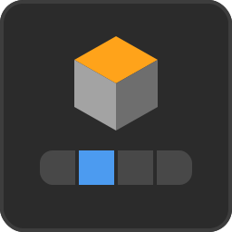 Asset Import Buttons

- **File:** `asset_import_buttons.py`
- **Tool name:** Asset Import Buttons
- **Location:** Asset Browser › Header (at the very start, left side)

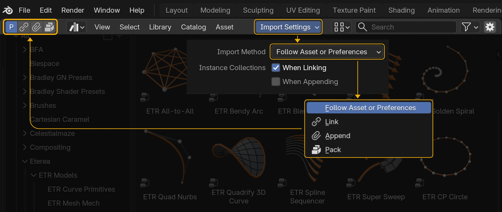

Adds four small toggle buttons to the Asset Browser header to see and change the **Import Method** at a glance: **P** (Follow Asset or Preferences), **Link**, **Append** and **Pack**. The active method is highlighted.

- The buttons control exactly the same setting as Blender's native *Import Settings* popover, so both are always in sync.
- They are placed at the start of the header, so they stay visible even when the editor is narrow.
- They are hidden in the regular File Browser, and in the *Current File* and *Essentials* libraries (where nothing is imported).
- The setting is per editor: each Asset Browser keeps its own value.

###  Batch Operate Attributes

- **File:** `batch_operate_attributes.py`
- **Tool name:** Batch Operate Attributes
- **Location:** 3D Viewport (Object Mode) › Right-Click › Eterea Tools, and Outliner › Right-Click › Eterea Tools

Two commands to manage an attribute on many objects at once. They work on **Mesh**, **Curves** (the hair / Geometry Nodes curves) and **Point Cloud** objects, and are only shown when at least one of them is selected. (Legacy Bezier / NURBS Curve objects have no generic attributes, so they are ignored.)

- **Rename Attribute on Selected Objects:** pick the current name and type the new one. The attribute is renamed on every selected object that has it. If an object already has an attribute with the new name, it is skipped, so nothing is ever overwritten.
- **Delete Attribute on Selected Objects:** pick the name. The attribute is removed from every selected object that has it.

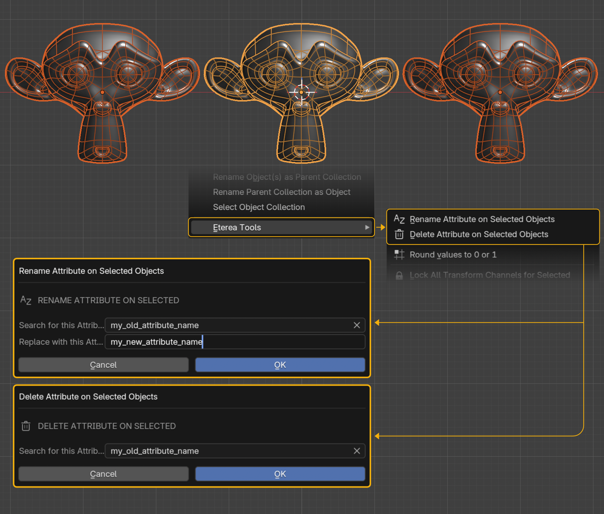

Clicking the name field opens a **searchable list of the attributes found on the selected objects**, with their domain, type and on how many of the selected objects each one exists (for example *Point · Float · 3 of 4*). Typing filters the list, and any other name can still be typed. Internal attributes (names starting with a dot) are not listed.

A message in the status bar reports how many objects were changed, how many were skipped (new name already in use, or a built-in attribute such as `position` that cannot be renamed or deleted), or that the attribute was not found. Objects that share their data (linked duplicates) count once.

###  Change Color Space

- **File:** `change_color_space.py`
- **Tool name:** Change Color Space
- **Location:** Shader Editor › Right-Click › Eterea Tools

Two commands set the Color Space of the images used by the selected *Image Texture* nodes:

- **Color Space to Non-Color** (for data maps: roughness, normal, displacement...)
- **Color Space to sRGB** (for color maps)

How to use it: select one or several *Image Texture* nodes, right-click in the Shader Editor and choose the command from **Eterea Tools**. It also works inside node groups. Nodes without an image are ignored, and a message reports how many images were changed.

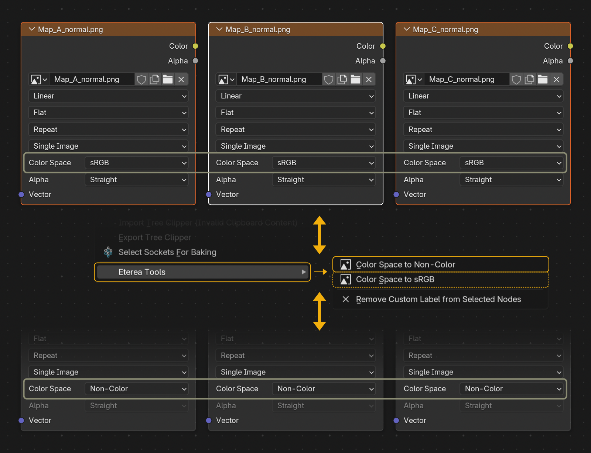

Note: the Color Space belongs to the image itself, so any other node using the same image is affected too. If your OCIO configuration has no color space with that exact name (for example a custom ACES configuration), nothing is changed and an error message tells you so.

### 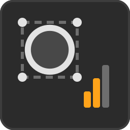 Change Selected SDS Levels

- **File:** `change_selected_sds_levels.py`
- **Tool name:** Change Selected SDS Levels
- **Location:** 3D Viewport › Sidebar (N) › Eterea Tools › Subdivision › *Levels*

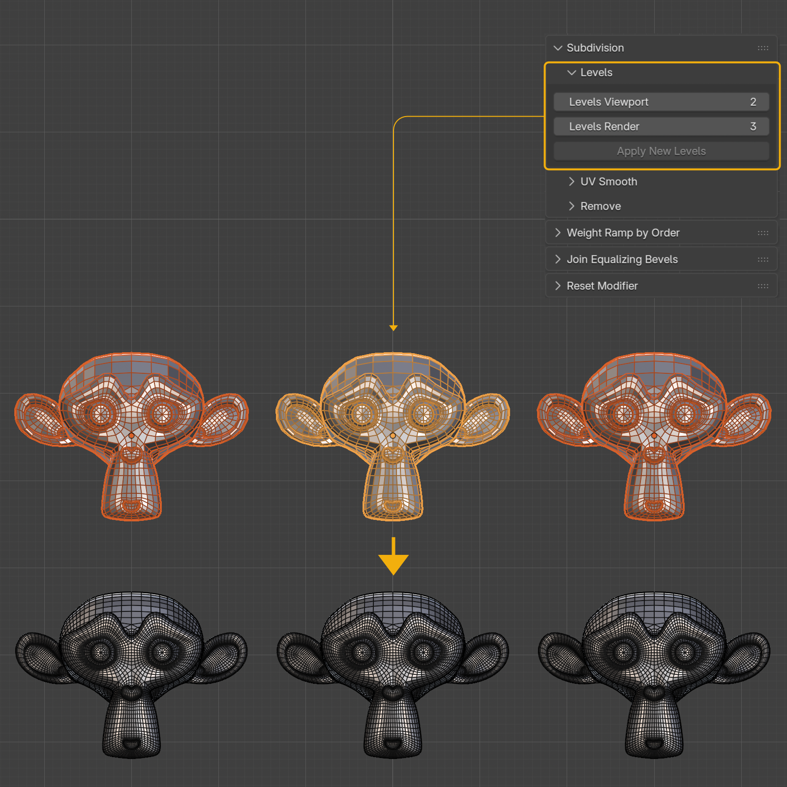

Set **Levels Viewport** and **Levels Render** in the panel (0 to 6), then click **Apply New Levels**: every Subdivision Surface modifier on the selected objects gets those values. The two numbers are saved with the scene. A message reports how many modifiers were changed (or that none was found).

### 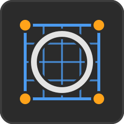 Change SDS UV Smooth

- **File:** `change_selected_sds_uv_smooth.py`
- **Tool name:** Change SDS UV Smooth
- **Location:** 3D Viewport › Sidebar (N) › Eterea Tools › Subdivision › *UV Smooth*

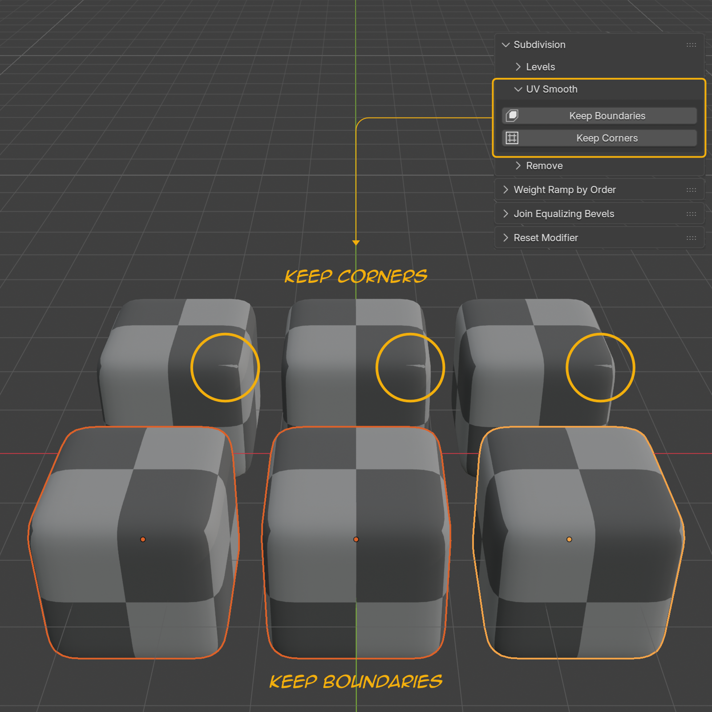

Two buttons, **Keep Boundaries** and **Keep Corners**, set the *UV Smooth* option of every Subdivision Surface modifier on the selected objects (all the Subdivision Surface modifiers of each object, if it has more than one). It saves you from changing the option object by object when many objects share the same UV layout. A message reports how many modifiers were changed.

### 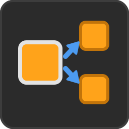 Copy Viewport Color

- **File:** `copy_viewport_color.py`
- **Tool name:** Copy Viewport Color
- **Location:** 3D Viewport › Object › Link/Transfer Data (`Ctrl+L` / `Cmd+L`) › Copy Viewport Color

Copies the **Viewport Display › Color** of the active object to all the other selected objects, whatever their type. Select the targets first and the source object last (so it is the active one).

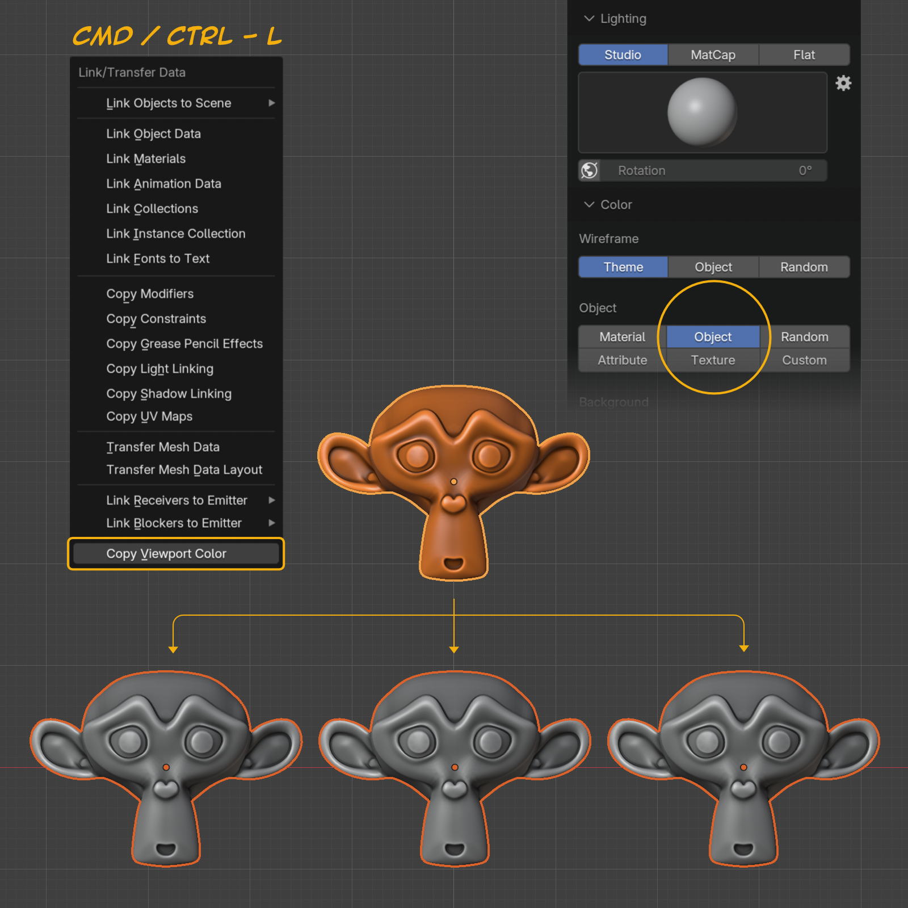

If a future Blender version renames the *Link/Transfer Data* menu, the command automatically moves to the 3D Viewport right-click menu instead.

### 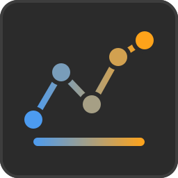 Weight Ramp by Order

- **File:** `create_weight_ramp.py`
- **Tool name:** Weight Ramp by Order
- **Location:** 3D Viewport › Sidebar (N) › Eterea Tools › *Weight Ramp by Order*

Creates a Vertex Group whose weights follow the **order in which you select the vertices**:

1. Go into Edit Mode on a mesh, in Vertex Select mode.
2. Click the first vertex, then `Shift`+click the rest one by one, in the order you want.
3. Click **Create Weight Ramp**.

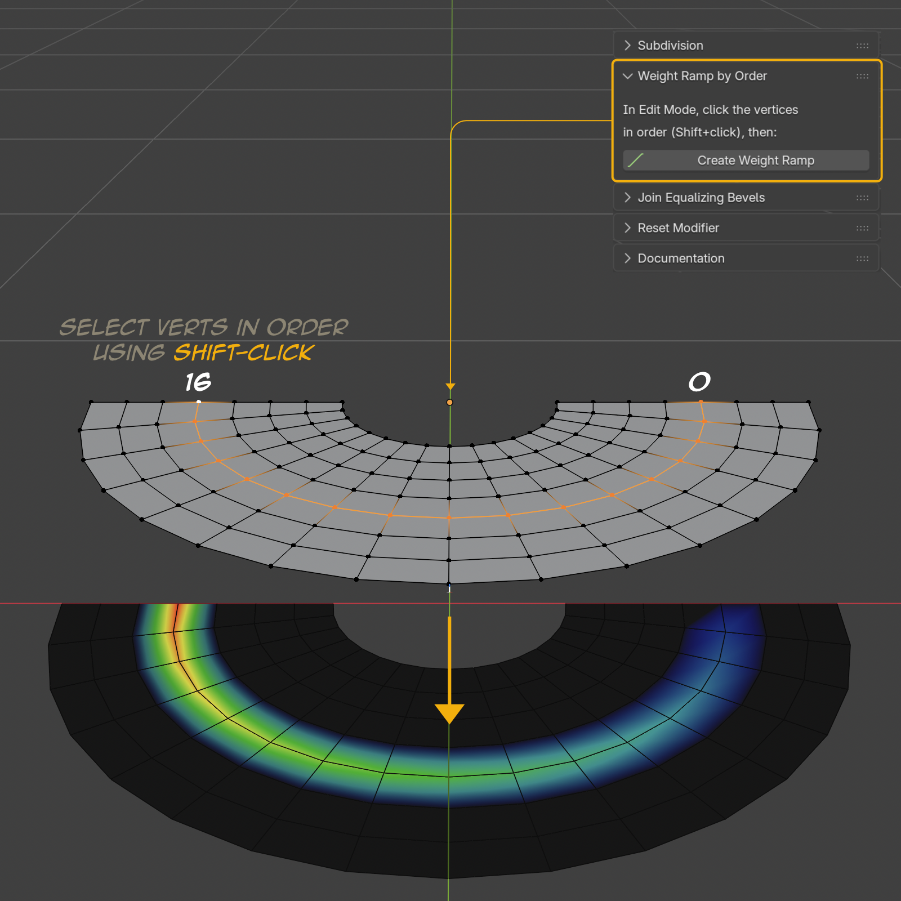

A new Vertex Group named **ETR VertSelOrder 000** (then 001, 002...) is created, with weights ramping linearly from 0 (first vertex selected) to 1 (last vertex selected). The object then switches to Weight Paint Mode so you can see the result. Useful, for example, to drive effects along a path of vertices.

The order comes from Blender's own selection history, which only records vertices picked with a click: vertices selected with Box Select, Select All, Select Linked, etc. are ignored (a message tells you how many). The command can be undone with `Ctrl+Z`.

###  Custom Color Nodes

- **File:** `custom_color_nodes.py`
- **Tool name:** Custom Colors Palette
- **Location:** Node Editor (Geometry Nodes, Shader, Compositor, Texture) › Sidebar (N) › Node › *Custom Colors Palette*. Also as a floating palette, opened with the **D** key over any node editor; it stays open while you try several colors and closes when the mouse leaves it.
- **Preferences:** Preferences › Add-ons › Eterea Blender Tools › *Custom Color Nodes*

Sets the background color of the selected nodes and frames from a palette of 20 color swatches, in two rows:

- **Row 1:** 10 vibrant colors, freely editable in the Preferences (color wheel, RGB / HSV / Hex), each with an editable name (Grey, Red, Orange... by default).
- **Row 2:** 10 darkened colors, derived automatically from row 1. Two sliders shared by all ten, **Saturation** and **Value**, scale the saturation and value of each vibrant color.

The tooltip of each swatch shows the name of its color on the second line (*Dark* + name for row 2).

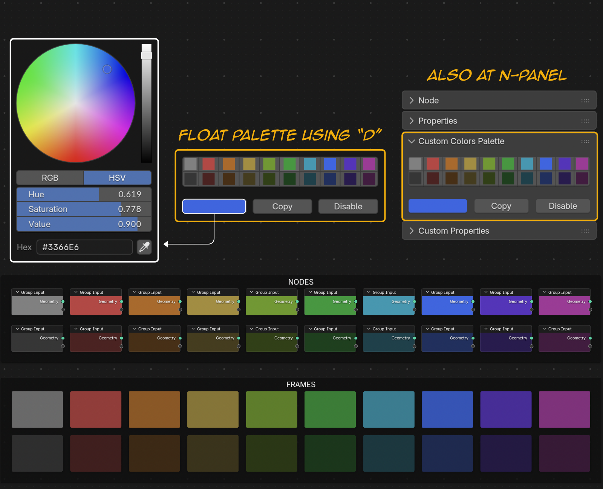

Below the swatches:

- **Color:** live color picker; any change is applied right away to the selected nodes and frames.
- **Copy from Active:** copies the color of the active node or frame to all the selected ones.
- **Disable:** turns the custom color off on the selected nodes and frames.

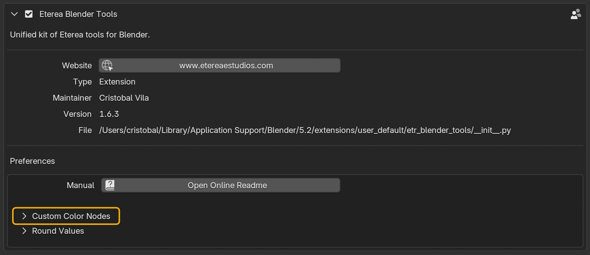

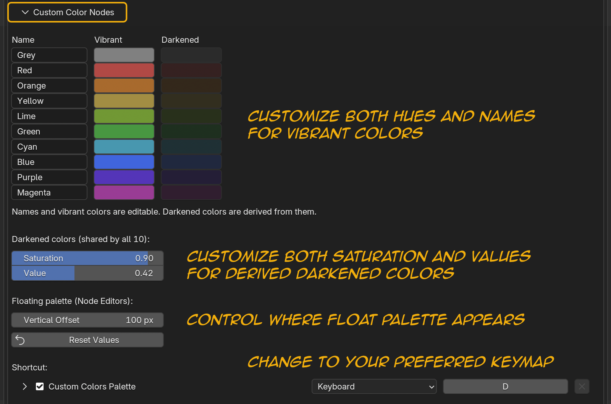

In the Preferences, **Reset Values** restores the 10 original colors and their names, the default Saturation and Value, and the default Vertical Offset. All values are stored in the Preferences, so they persist between sessions. The shortcut of the floating palette and its **Vertical Offset** (how many pixels above the mouse pointer it opens, so it does not cover the nodes; negative values move it down) can also be changed there.

### 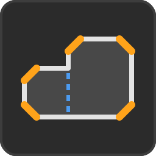 Join Equalizing Bevels

- **File:** `join_equalizing_bevels.py`
- **Tool name:** Join Equalizing Bevels
- **Location:** 3D Viewport › Sidebar (N) › Eterea Tools › *Join Equalizing Bevels*

Joins the selected objects (into the active one) while keeping each part's bevel size:

1. It finds the highest Bevel modifier *Amount* among the selected objects.
2. It scales each object's edge *Bevel Weights* by its own Amount divided by that highest Amount.
3. It joins the objects and sets the remaining Bevel modifier to the highest Amount.

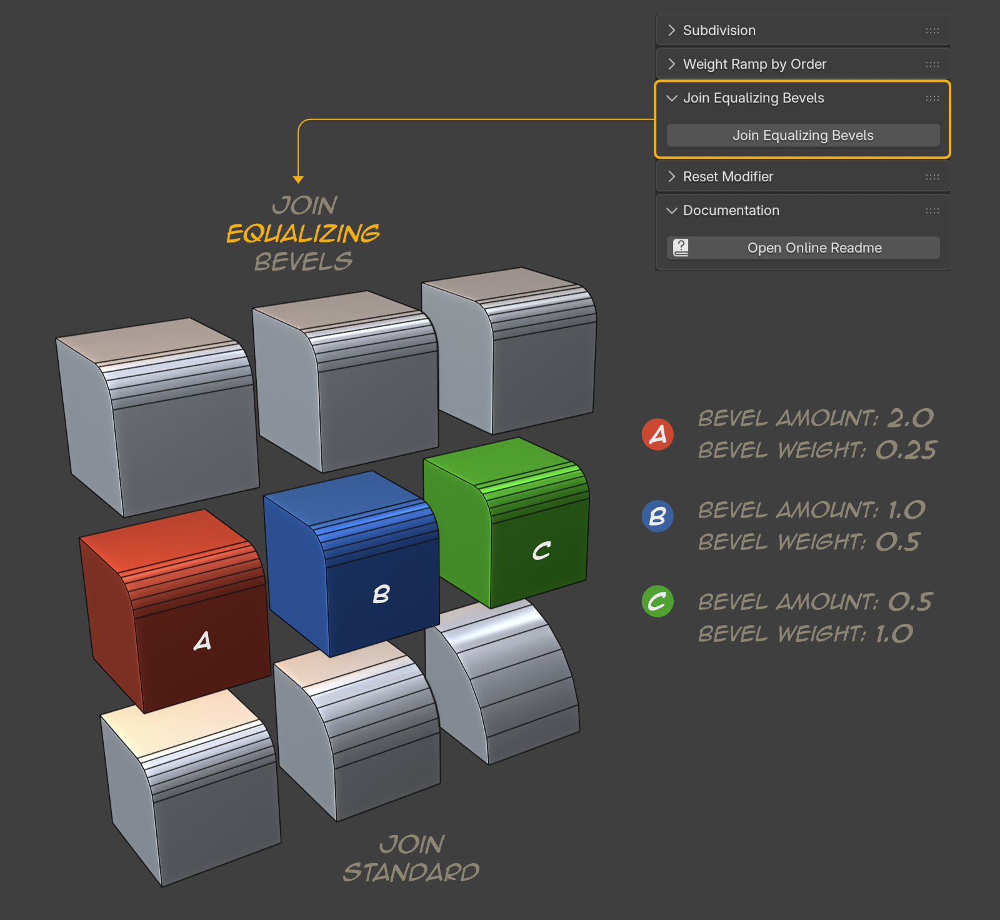

Requirements: Object Mode, at least two meshes selected, and a Bevel modifier on the **active** object (it is the one kept after the join). The Bevel modifiers should be limited by *Weight* and affect *Edges*; if one does not, the result is still joined but a warning tells you its size may differ. Only the first Bevel modifier of each object is taken into account, and the objects are assumed to have the same scale.

Nothing is changed (and a message explains why) if the highest Amount is 0 or if a mesh that needs rescaling is shared with other objects (linked duplicates): make it single-user first with *Object › Relations › Make Single User*.

###  Remove Custom Label from Selected Nodes

- **File:** `remove_custom_label.py`
- **Tool name:** Remove Custom Label from Selected Nodes
- **Location:** Node Editors (Shader, Geometry Nodes, Compositor, Texture) › Right-Click › Eterea Tools

Clears the **Custom Label** (the *Label* field in the Sidebar › Node tab) of every selected node, so each node goes back to showing its default name. Frames are included. Nodes that have no Custom Label are left untouched. A message reports how many nodes were changed.

#### Use case

Node Wrangler creates this “Normal” or “Base Color” custom labels, automatically, at using Shift-Ctrl-T for “Add Principled Texture Setup”. By removing those custom labels I get the original full image names, and then I can collapse my nodes while knowing what's inside:

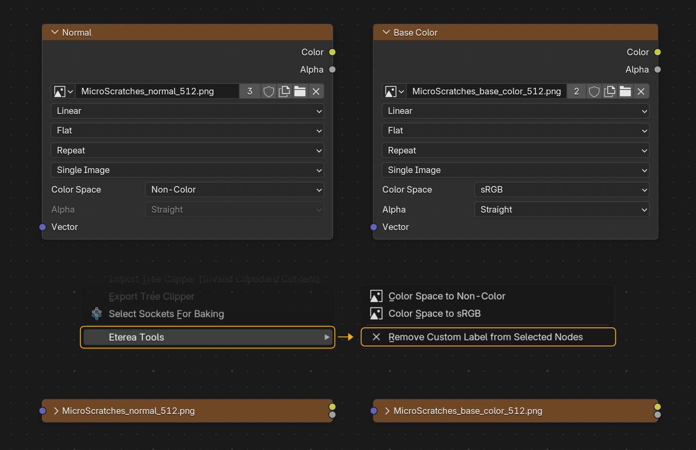

And of course, you can instantly remove all the custom labels you’ve previously created from as many nodes as you like—in any editor—if you decide you no longer want them…

###  Remove Subdivision Modifiers

- **File:** `remove_subdivision_modifiers.py`
- **Tool name:** Remove Subdivision Modifiers
- **Location:** 3D Viewport › Sidebar (N) › Eterea Tools › Subdivision › *Remove*

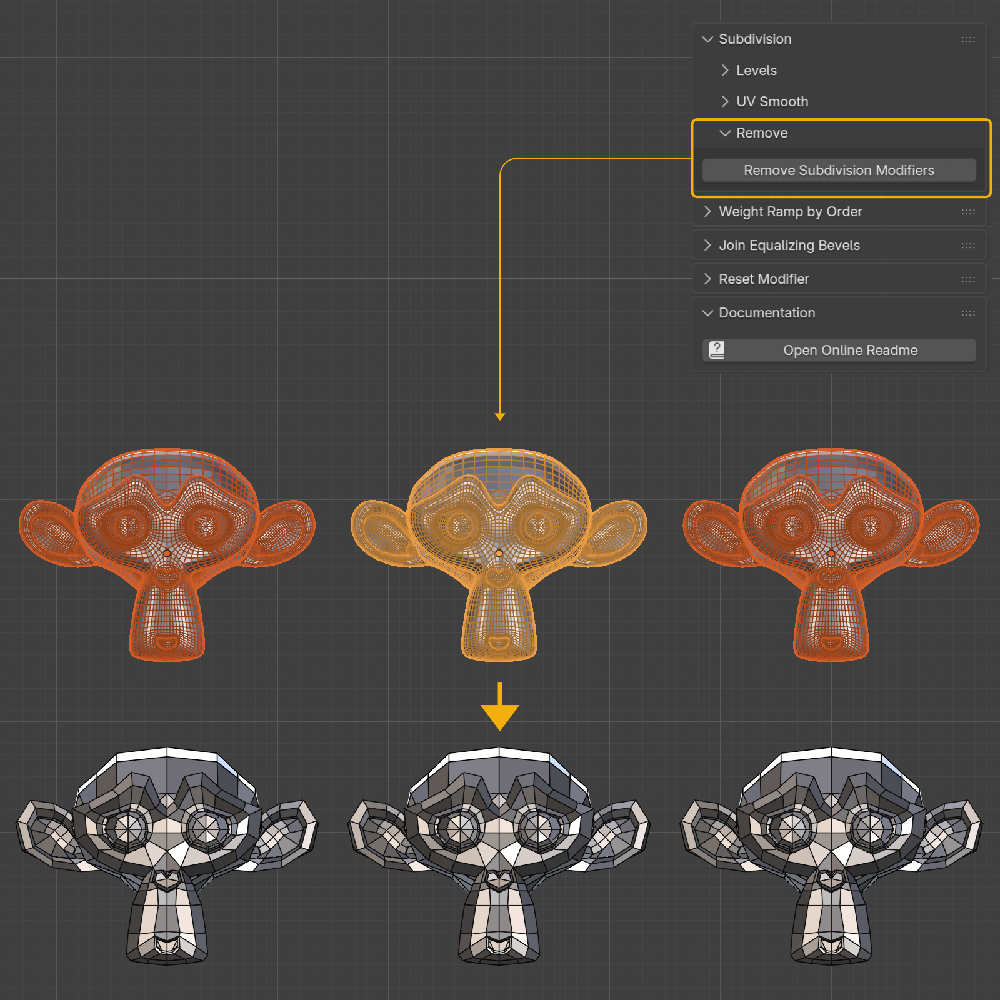

One button that deletes every Subdivision Surface modifier from the selected objects. A message reports how many modifiers were removed.

###  Reset Active Modifier to Defaults

- **File:** `reset_active_modifier.py`
- **Tool name:** Reset Active Modifier to Defaults
- **Location:** 3D Viewport › Sidebar (N) › Eterea Tools › *Reset Modifier*. Also in Properties › Modifiers › **Right-Click on any parameter of a modifier** › *Reset Modifier to Defaults*

The panel shows the active modifier of the active object, and its button resets that modifier. From the right-click menu, the modifier whose parameter you clicked is reset, whether it is the active one or not (the active modifier does not change). The modifier's own header menu (the down arrow) cannot be extended by add-ons, which is why the right-click menu is used.

**Reset Modifier to Defaults** puts all its parameters back to the values of a newly added modifier of the same type (including vector parameters such as the Mirror axes or the Array offsets). For **Geometry Nodes** modifiers, the exposed inputs (value, and *Value / Attribute* mode with its attribute name) are reset to the defaults defined in the node group.

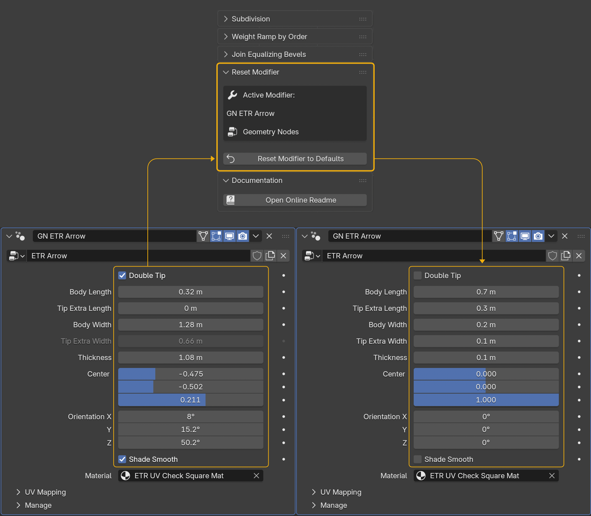

What is kept: the name, the header toggles (Viewport, Render, Edit Mode, On Cage), *Pin to Last*, the expanded/collapsed state of the panel, the objects or data-blocks the modifier points to (Mirror object, Boolean object, the node group itself...) and the Geometry Nodes bake settings. A message reports how many values were changed.

### 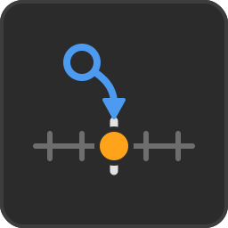 Round Values

- **File:** `round_values.py`
- **Tool name:** Round Values
- **Location:** 3D Viewport › Object › Transform › *Round Values to 0 or 1* and *Round Near-Integer Values*. Also in 3D Viewport (Object Mode) › Right-Click › Eterea Tools, and Outliner › Right-Click › Eterea Tools

Cleans up tiny floating-point leftovers on the selected objects (for example a location of 0.000012 after moving things around). There are two commands:

#### Round Values to 0 or 1

- Location and Rotation values very close to 0 become exactly **0**.
- Scale values very close to 1 or -1 become exactly **1** or **-1**.

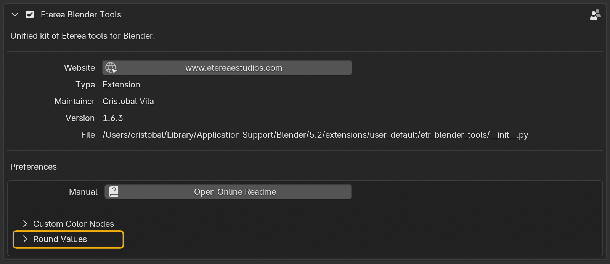

#### Round Near-Integer Values

Extends the rounding to **any whole number**, positive or negative, using the same thresholds. Only values that are already *almost* a whole number change (`8.000025` becomes `8.0`, but `8.025` does not):

- Location `5.00001` becomes `5.0`, and `-42.00002` becomes `-42.0`. But `5.01` or `-45.005` stay as they are.
- Rotation (in degrees) `-17.00003` becomes `-17.0`. But `-14.05` stays as it is.
- Scale `8.00004` becomes `8.0`. But `8.005` stays as it is.
- A **Scale is never rounded to 0**, because that would collapse the object (a scale of 0.00001 stays untouched).
- The whole numbers are those of Blender internal units (metres for location), whatever the scene unit system.

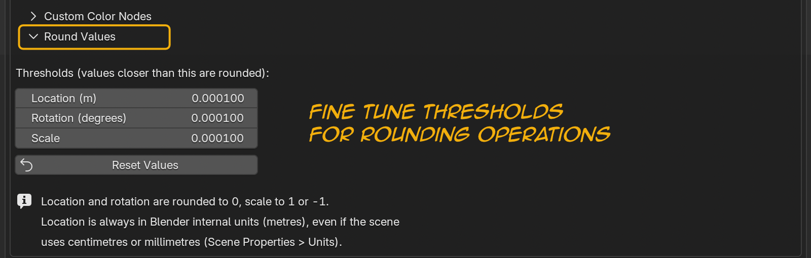

**The user can control the thresholds** for the rounding operations in:

- **Preferences:** Preferences › Add-ons › Eterea Blender Tools › *Round Values*


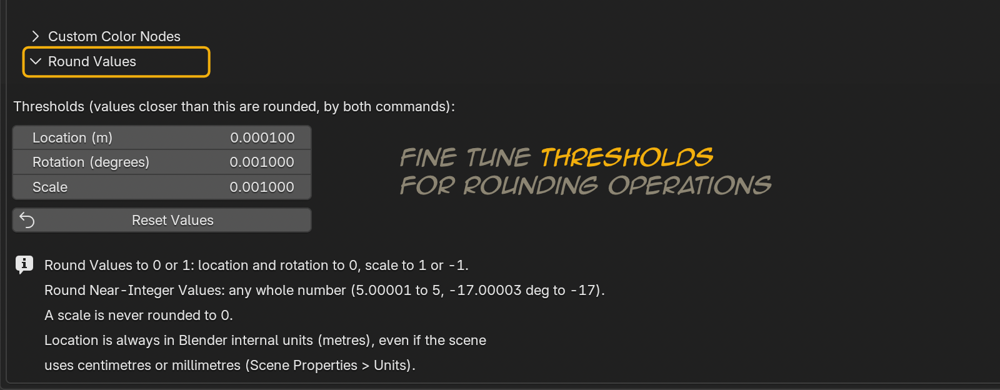

Both commands share the same thresholds, which are **0.0001** by default (metres for location, degrees for rotation, plain factor for scale) and can be changed in the Preferences, where **Reset Values** restores the defaults. Location is always measured in Blender internal units (metres), even if the scene uses centimetres or millimetres. Euler, Quaternion and Axis Angle rotation modes are supported. A message reports how many channels were rounded; repeating a command on values that are already rounded reports that nothing needed rounding.

###  Set Curve Radius to 1.0

- **File:** `set_curve_radius_to_1.py`
- **Tool name:** Set Curve Radius to 1.0
- **Location:** 3D Viewport › Curve Edit Mode › Right-Click › Eterea Tools

Sets the radius of all selected control points to **1.0**. Works on Bezier, Poly and NURBS splines, and on every curve object being edited at the same time (multi-object Edit Mode). A message reports how many points were changed.

To use another value, open the *Adjust Last Operation* panel (`F9`) right after the command and change **Radius**. The menu command always starts from 1.0.

###  Toggle Lock Channels for Selected

- **File:** `toggle_lock_transform_channels.py`
- **Tool name:** Toggle Lock Channels for Selected
- **Location:** 3D Viewport (Object Mode) › Right-Click › Eterea Tools, and Outliner › Right-Click › Eterea Tools

Eight commands, in two groups, that lock or unlock the transform channels of every selected object (any object type):

- **Lock** All Transform / Location / Rotation / Scale Channels for Selected
- **Unlock** All Transform / Location / Rotation / Scale Channels for Selected

The rotation commands also lock or unlock **W**, used by Quaternion and Axis Angle rotations.

### 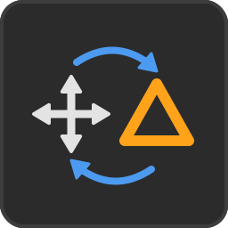 Transform and Deltas

- **File:** `transforms_deltas.py`
- **Tool name:** Transform and Deltas
- **Location:** Properties › Object › Transform › *Manage Deltas*

A compact sub-panel with two columns of buttons that work on all selected objects. *Delta Transforms* are an extra offset, rotation and scale applied on top of the regular transform. The buttons let you move values between the two without the object moving:

- **Left column — ▽ to Deltas:** **▽ All Transforms to Deltas** on top, and **▽ Loc / ▽ Rot / ▽ Scale** below it. Moves the current value into the matching Delta Transform and resets the regular value (0 for location and rotation, 1 for scale).
- **Right column — △ Reset Deltas:** **△ Reset All Deltas** on top, and **△ Loc / △ Rot / △ Scale** below it. Merges the Delta Transform back into the regular value and resets the delta.

Hover over any button to see its tooltip. The buttons are disabled when no object is selected.

The rotation buttons work with the **Euler** (XYZ, XZY...) and **Quaternion** rotation modes, in both directions. (Blender's own *Object › Apply › Rotation to Deltas* has no inverse; here *△ Rot* merges the delta back for both modes.) **Axis Angle** has no delta rotation in Blender: those objects keep their rotation unchanged and a warning tells you how many were skipped (their location and scale are still processed by the *All* buttons).

---

## For developers

### Kit structure

```
blender_manifest.toml   Extension metadata (id, version, license...)
__init__.py             Imports and registers every module listed in MODULES
eterea_ui.py            Shared UI: "Eterea Tools" Sidebar tab and right-click submenus (3D Viewport, Outliner, Node Editors)
preferences.py          Shared Preferences: the kit's single AddonPreferences, one section per tool
documentation.py        Shared UI: "Open Online Readme" button (Preferences and Sidebar); always registered last
<tool>.py               One module per tool
```

The documentation (this manual, the changelog, the icons and the screenshots) lives outside the kit, in the `etr_blender_tools_docs/` folder next to it, so it is never included in the installable `.zip`.

Every tool module starts with the same header: SPDX license line, copyright, a short docstring with technical notes, and a `bl_info` dictionary (name, author, version, Blender version, location, description, category). Inside an Extension Blender reads only `blender_manifest.toml`, so `bl_info` is kept purely as per-tool documentation and version history.

### Adding a new tool

1. Copy the new `.py` file into the kit folder.
2. Add its module name (without `.py`) to the `MODULES` tuple in `__init__.py`, in alphabetical order and before `documentation`, which must stay last.
3. If it needs the kit's Sidebar tab, use `bl_category = eterea_ui.SIDEBAR_CATEGORY` in its panels.
4. If it needs the **Eterea Tools** right-click submenu, register a section in its `register()` function and remove it in `unregister()`:

```python
from . import eterea_ui

def draw_eterea_tools_section(layout, context):
    layout.operator("object.my_operator")

def register():
    ...
    eterea_ui.add_section(eterea_ui.OBJECT_CONTEXT, __name__, draw_eterea_tools_section)

def unregister():
    eterea_ui.remove_section(eterea_ui.OBJECT_CONTEXT, __name__)
    ...
```

Available contexts: `OBJECT_CONTEXT`, `OUTLINER_CONTEXT`, `EDIT_CURVE_CONTEXT`, `NODE_CONTEXT` (every Node Editor). A tool can register the same section in several contexts. An optional `poll_fn(context)` can be passed to hide the section when it does not apply.

5. If it needs its own preferences, see the docstring of `preferences.py`: register the tool's `PropertyGroup` there, add one `PointerProperty` line to `EtereaPreferences`, and call `preferences.add_section(...)` / `preferences.remove_section(...)` from the tool's `register()` / `unregister()`.
6. Increase `version` in `blender_manifest.toml`, document the tool in this manual and add an entry to `CHANGELOG.md` (both in `etr_blender_tools_docs/`), then add its icon (see [icons/ICON_STYLE.md](icons/ICON_STYLE.md)) and a row in the table of the repository `README.md`.

### Naming conventions for new tools

- Operator identifiers with the kit prefix: `bl_idname = "object.etr_my_tool"` (class `OBJECT_OT_etr_my_tool`).
- Menus and panels with the `ETR_` prefix: `ETR_MT_my_menu`, `ETR_PT_my_panel`.
- Properties stored on Blender data (Scene, Object...) with the `etr_` prefix: `Scene.etr_my_setting`.
- Python class names match their `bl_idname` (`OBJECT_OT_my_tool` for `object.my_tool`).

Older tools keep their original identifiers on purpose: renaming an operator breaks the shortcuts and Quick Favorites that point to it, and renaming a stored property loses the values saved in `.blend` files or in the Preferences.

### Building the .zip

```
blender --command extension build --source-dir etr_blender_tools
```

The `[build]` section of the manifest keeps `__pycache__` and hidden files out of the package. `blender --command extension validate etr_blender_tools` checks the manifest.

---

## Version history

See [CHANGELOG.md](CHANGELOG.md).

---

## Credits

Ideas and specifications by Cristobal Vila (etereaestudios.com). Code written with the help of AI assistants (originally ChatGPT and Claude; maintained with Claude).
